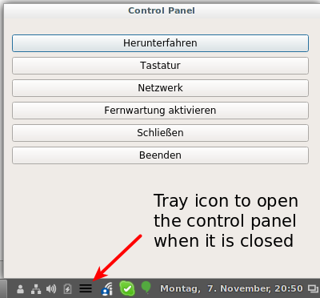

Control Panel
=============

It's an easily customizable system control panel.
It comes with a tray icon to show the panel if it's hidden.



It's written in C++ based on [Qt5](https://www.qt.io/).
It could serve as a demo on how to use tray icons and how to run shell commands with the `system` function.

Example configuration
---------------------

Example configuration file `~/.config/controlpanel/buttons.conf`:

```
# This is a comment line.

# Columns are separated with a tab:

# - Button caption
# - Primary button shell command
# - Shell command to determine button visibility (default: always visible)
# - Flag to indicate if the window should be hidden after clicking the button
#   (0 or 1; default: 0 -> window is not hidden)

# Trailing columns can be omitted.

# Don't forget the trailing "&" in the primary command
# to run a command in background.

# :quit and :close are special commands.

Herunterfahren	xmessage shutdown -h now &	true
Tastatur	florence &	true	0
Netzwerk	nm-connection-editor &	true	1
Fernwartung aktivieren	xmessage autossh ...	! ps -C autossh
Fernwartung deaktivieren	florence &	ps -C autossh
Invisible	xmessage hallo &	false
Schließen	:close
Beenden	:quit
```

Disclaimer
----------

This is my first Qt project and it's years ago that I programmed in C++.
So maybe I use pointers vs. references inconsistently.
Probably there are some variables, parameters, or methods that should better be `const`.
Maybe I forgot to `delete` some objects (unsure what Qt deletes for me).
And the design is still evolving :)
